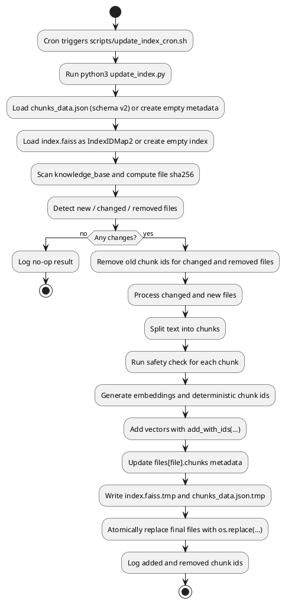

# Update Index Process

Ниже диаграмма процесса инкрементального обновления индекса с `IndexIDMap2` и файловыми метаданными чанков.

## Cron usage

- Скрипт запуска: `scripts/update_index_cron.sh`
- Лог: `logs/update_index.log`
- Пример cron-правила (ежедневно в 06:00):
  - `0 6 * * * /absolute/path/to/architecture-pro-rag/scripts/update_index_cron.sh`
